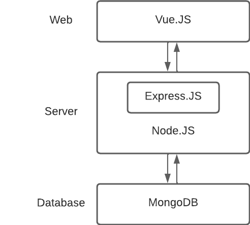
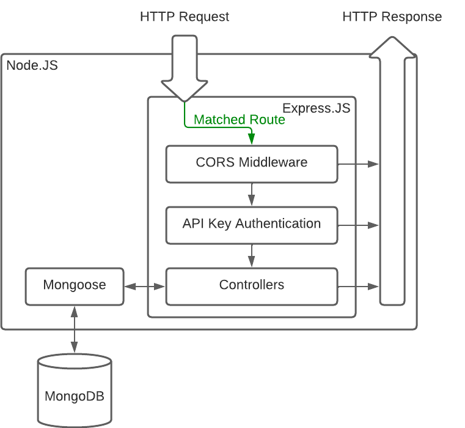

# autoSense Challenge Backend

This project contains the backend of the autoSense take home challenge. It uses Node.js with Typescript, ESLint and Prettier.

## Prerequisites
- Node.js 10+
- NPM

## Installation
- Install dependencies
```bash
npm install
```


- Start Application
```bash
npm start
```
The application will be launched by [Nodemon](https://nodemon.com). It will restart automatically on file change.

__A mongoDB database must be running for the application to work.__ Set the connection details in  `.env`.

## Documentation

### Frontend

Can be found [here](https://github.com/JannisTriesToCode/autoSense-challenge-frontend).

### Architecture

High Level



Backend



### API

API is auto-documented by swagger. Accessible at http://localhost:4500/doc/.

Note: The Patch Endpoint can only change the parameter `name` and the `price` of existing pumps. For the latter the `id` and new `price` are required.

Example for patch endpoint:

Call: `PATCH` `http://localhost:4500/fuelstations/MIGROL_100042`

Data:
```json
{    
    "name": "Migrol Tankstelle",
    "pumps": [
      {
        "id": 10001,
        "price": 1.68,
      },
      {
        "id": 10002,
        "price": 1.27,
      },
    ]
}
```

